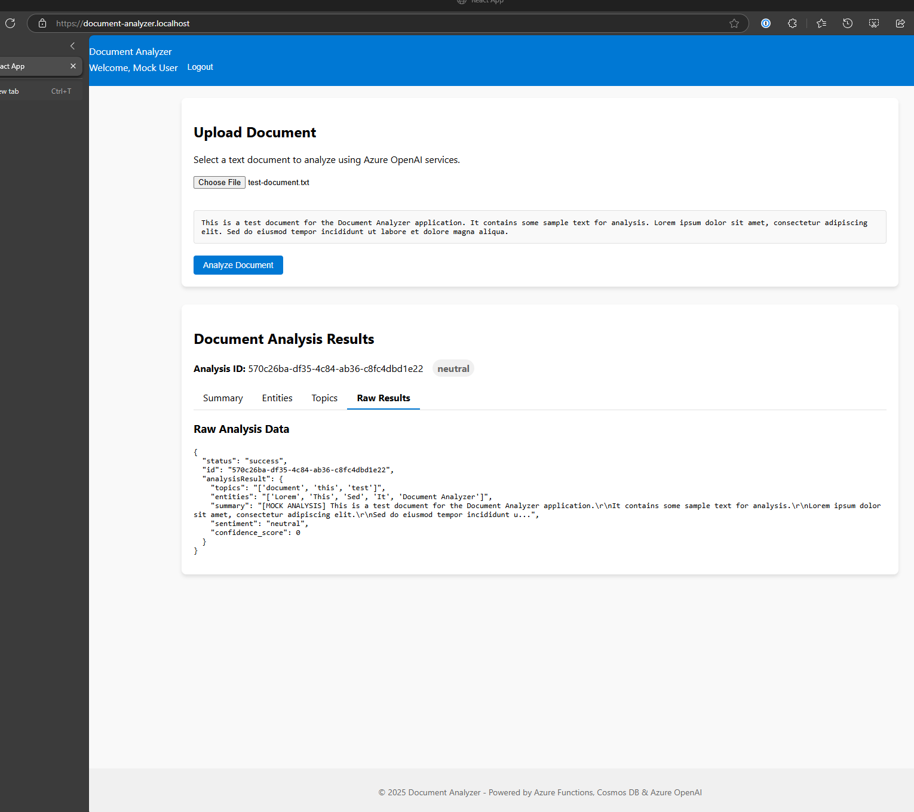
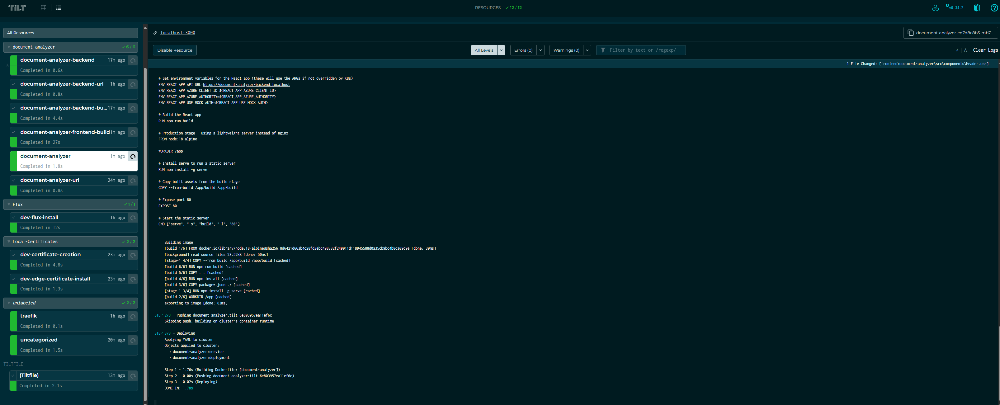

# Document Analyzer

A project that demonstrates Azure Functions, React, Azure OpenAI, and Cosmos DB integration for document analysis.

## Project Overview

This application processes documents using Azure OpenAI to extract key information, then stores results in Cosmos DB and displays them in a React frontend.

## Technologies Used

### Backend (Azure Functions)
- Python 3.9+
- Azure Functions
- Azure OpenAI
- Azure Cosmos DB
- Azure Identity for authentication

### Frontend
- React 18
- MSAL for Azure AD authentication
- UI with responsive design

### Development & Deployment
- Docker and Kubernetes for containerization
- Tilt for local development workflow automation
- Traefik for ingress controller and SSL termination
- OpenSSL for local certificate generation

## Architecture

```
┌─────────────┐      ┌─────────────┐      ┌─────────────┐
│   React     │      │   Azure     │      │    Azure    │
│  Frontend   │─────►│  Functions  │─────►│   OpenAI    │
└─────────────┘      └─────────────┘      └─────────────┘
                           │
                           ▼
                    ┌─────────────┐
                    │    Azure    │
                    │  Cosmos DB  │
                    └─────────────┘
```

## Backend Features

- Event-driven architecture using Azure Functions
- Advanced JSON transformation for handling nested data
- Retry mechanism with exponential backoff for API calls
- Authentication using Azure AD
- Comprehensive unit tests with mocking

## Frontend Features

- Modern React with hooks
- Azure AD authentication using MSAL
- Responsive UI
- Loading state and error handling
- Tabbed interface for displaying analysis results

## Getting Started

### Prerequisites
- Docker Desktop with Kubernetes enabled
- Node.js 16+ and npm
- Python 3.9+
- Tilt installed (https://tilt.dev/)
- kubectl configured to your local cluster
- OpenSSL for certificate generation
- Azure subscription (for cloud deployment)
- Visual Studio Code (recommended)

### Local Development

To start the local development environment with Tilt and Kubernetes, run:

```bash
# Start the Tilt development environment
tilt up
```

This will initialize the entire application stack in your local Kubernetes cluster. See the detailed instructions in the "Using Kubernetes with Tilt" section below.

## Azure Resources Required
- Azure Functions App
- Cosmos DB account with a 'DocumentAnalysis' database and 'Results' collection
- Azure OpenAI service with GPT-4 model deployed
- Azure AD application registration

## Testing

### Backend Tests
```bash
# Using Python unittest for backend tests
cd backend
python -m unittest discover tests

# Or use the custom test runner
cd backend
python tests/run_tests.py
```

#### Common Testing Issues

If you encounter errors when running the tests, make sure you have all the required dependencies installed:

```powershell
# Windows PowerShell
cd backend; pip install -r requirements.txt
```

```bash
# Linux/macOS
cd backend && pip install -r requirements.txt
```

Warnings about retries are expected during the retry_helpers tests - these are part of the test verification and not actual errors.

### Frontend Tests

The frontend has unit tests for React components:

```bash
# Run React component tests (from the frontend folder)
cd frontend/document-analyzer
npm test
```

The tests demonstrate how to test React components with mock data and simulated user interactions. The test suite includes:

- **Component Rendering Tests**: Verifies that components render without errors
- **State Management Tests**: Tests that component state changes correctly in response to user actions
- **Authentication Tests**: Verifies behavior under different authentication states
- **Error Handling Tests**: Tests component behavior when receiving error responses

#### Test Configuration

The project uses Jest and React Testing Library with the following configuration:

- Custom Jest configuration in package.json to handle ES modules in dependencies
- CSS file mocks to avoid styling issues during testing
- Mock implementations for external services (axios, MSAL)

#### Common Testing Issues

If you see React act() warnings during testing, these are related to the internal implementation of React Testing Library and don't affect test functionality.

For test failures related to text content, ensure that test assertions match the exact text used in components (e.g., "Logout" button text must match in both the component and test).

### Sample Data

The repository includes a `test-document.txt` file that can be used to test the document analysis functionality. Simply upload this file through the frontend interface when testing the application locally.

## Deployment

### Cloud Deployment
This project is designed to be deployed using Azure DevOps Pipelines or GitHub Actions.

Infrastructure is provisioned using Pulumi with templates from: 
https://github.com/TemplateMechanics/pulumi-azure

### Using Kubernetes with Tilt
For local development with Kubernetes, this project uses Tilt to automate the development workflow:

**Prerequisites:**
- Kubernetes cluster (like Docker Desktop with Kubernetes, Minikube, or Kind)
- Tilt installed: [https://tilt.dev/](https://tilt.dev/)
- kubectl configured to your local cluster
- OpenSSL for certificate generation

**Components setup:**
1. **Certificates**: Auto-generated using `./certificates/generate-certs.ps1` for secure local HTTPS
2. **Traefik Ingress**: Handles routing to services with TLS termination using wildcard certificate
3. **Azure Functions Backend**: Containerized Python Azure Functions app
4. **React Frontend**: Containerized React application with serve
5. **Kubernetes Secrets**: Automatically configured for local development

**Local URLs:**
- Backend API: https://document-analyzer-backend.localhost
- Frontend UI: https://document-analyzer.localhost
- Traefik Dashboard: http://localhost:9000/dashboard/ (when enabled)

**Running with Kubernetes:**
```bash
tilt up
```
See https://tilt.dev for more information.

Once running, the frontend automatically uses mock authentication in the local development environment. When accessing the application, you'll be automatically logged in with a mock user account (email: mockuser@example.com).

Tilt will:
- Build the Docker images for both backend and frontend
- Deploy to Kubernetes with configured secrets and resources
- Set up port forwarding and ingress routes
- Watch for file changes and automatically rebuild/redeploy
- Provide live status updates in the Tilt UI (http://localhost:10350)

For more information on Tilt configuration, see the [Tilt Documentation](https://docs.tilt.dev/)

**Traefik Configuration:**

The project uses Traefik as an ingress controller with the following features enabled:
- Automatic TLS termination using locally generated certificates
- Route matching for backend and frontend services
- Dashboard for monitoring (accessible at http://localhost:9000/dashboard/ when enabled)

## Development Notes

### Entity and Topic Extraction
The document analyzer uses a simple extraction algorithm for entities and topics in development mode:

- **Entities**: In development mode, the system looks for capitalized words, money amounts (like $100M), and percentages (like 25%) in the document. If no matches are found, the system first tries to extract words of interest from the document and capitalizes them. If still no entities are found, default entities ("Document", "Content", "Analysis") are used.

- **Topics**: The system extracts frequently occurring words with at least 4 characters and sorts them by frequency. If no suitable topics are found, the system looks for meaningful words in the document. If still no topics are found, default topics ("document", "analysis", "content") are used.

The enhanced extraction logic ensures that you'll always see entities and topics in your analysis results, even when using simple documents. For more meaningful results, try using documents with proper nouns, technical terms, or recurring themes.

Debug logging has been added to the backend to help diagnose any issues with entity and topic extraction. You can check the function logs for entries like "Generated mock response: topics=..., entities=..."

### Common Development Commands

#### Windows PowerShell

```powershell
# Run backend tests
cd backend; python -m unittest discover tests
# Note: The above command shows warnings about retries which are part of the test process

# Run frontend tests
cd frontend/document-analyzer; npm test

# Build Docker images directly
docker build -t document-analyzer-backend ./backend
docker build -t document-analyzer-frontend ./frontend/document-analyzer

# Stop Tilt development environment
# Press Ctrl+C in the terminal where Tilt is running
tilt down

#### Linux/macOS Bash
```bash
# Run backend tests
cd backend && python -m unittest discover tests

# Run frontend tests
cd frontend/document-analyzer && npm test

# Build Docker images directly
docker build -t document-analyzer-backend ./backend
docker build -t document-analyzer-frontend ./frontend/document-analyzer

# Stop Tilt development environment
# Press Ctrl+C in the terminal where Tilt is running
tilt down
```

### Troubleshooting

#### Frontend Test Issues
If you encounter issues with frontend tests:

```powershell
# Make sure Jest can handle ES modules by checking package.json has proper configuration:
# "jest": {
#   "transformIgnorePatterns": ["node_modules/(?!(axios|@azure/msal-browser|@azure/msal-react)/)"]
# }

# Ensure you have the setupTests.js file in the src directory:
cd frontend/document-analyzer/src
notepad setupTests.js
# The file should import '@testing-library/jest-dom'

# Clear Jest cache if needed
cd frontend/document-analyzer
npm test -- --clearCache
```

For ES module errors with external dependencies, you may need to update the transformIgnorePatterns to include those specific modules.

#### Certificate Issues
If you encounter SSL certificate issues:
```powershell
# Regenerate certificates
Click on the "recycle" button on the "dev-certificate-creation" task in the Tilt UI
```

#### Certificate Installation in Kubernetes
The dev-edge-certificate-install step sometimes fails during the initial setup. If you encounter certificate-related errors or if HTTPS connections are failing, you may need to manually re-run the certificate installation by clicking the recycle button on the task in the Tilt UI

#### Kubernetes Connection Problems
If Tilt cannot connect to your Kubernetes cluster:
```powershell
# Verify your kubectl configuration
kubectl config current-context
kubectl cluster-info

# Make sure Docker Desktop Kubernetes is enabled (if using Docker Desktop) - Podman or other local K8S Clusters work.
```

#### Ingress Not Working
If applications are not accessible via *.localhost URLs:
```powershell
# Check that Traefik is running
kubectl get pods -n traefik

# Verify Traefik ingress rules
kubectl get ingress -A

# Verify your hosts file has the proper entries
# Add to C:\Windows\System32\drivers or \etc\hosts:
# 127.0.0.1 document-analyzer-backend.localhost document-analyzer.localhost
```

### Understanding the Tilt Configuration

The `Tiltfile` contains the configuration for local Kubernetes development:

1. **Extensions Loading**:
   - Uses Helm, Namespace, and Certificate Manager extensions for Kubernetes resource management

2. **Helper Functions**:
   - `certificate_creation`: Generates local SSL certificates using OpenSSL
   - `install_flux`: Sets up Flux for GitOps deployments (if needed)
   - `deploy_container_app`: Automates container deployment with proper resources and configurations

3. **Namespaces and Resources**:
   - Creates dedicated namespaces for services: `flux`, `traefik`, and `document-analyzer`
   - Configures secrets for local development with mock Azure credentials
   - Sets up persistent storage for data retention between deployments

4. **Live Reload**:
   - Watches critical files for changes and automatically rebuilds/redeploys affected components
   - Ensures fast development iterations with minimal manual steps

5. **Environment Configuration**:
   - Uses Kubernetes secrets to manage sensitive configuration data
   - Automatically injects environment variables into containers
   - Supports mock authentication for frontend development

### Screenshots

**Document Analyzer Application**



**Tilt Development UI**



### Project Structure
```
├── backend/                   - Azure Functions backend
│   ├── Dockerfile            - Backend containerization
│   ├── host.json             - Azure Functions host configuration
│   ├── requirements.txt      - Python dependencies
│   ├── AnalysisFunction/     - Azure Function code
│   │   ├── __init__.py       - Main function code
│   │   ├── function.json     - Function configuration
│   │   └── function.cors.json - CORS settings
│   ├── SharedCode/           - Shared utilities
│   │   ├── __init__.py
│   │   ├── json_helpers.py   - JSON processing utilities
│   │   └── retry_helpers.py  - Retry mechanisms
│   └── tests/                - Backend unit tests
│       ├── __init__.py
│       ├── run_tests.py      - Test runner script
│       ├── test_analysis_function.py
│       ├── test_json_helpers.py
│       └── test_retry_helpers.py
├── frontend/                 - React frontend
│   └── document-analyzer/
│       ├── Dockerfile        - Frontend containerization
│       ├── nginx.conf        - NGINX config for static serving
│       ├── package.json      - NPM dependencies
│       ├── public/           - Static assets
│       └── src/              - React application code
│           ├── App.js
│           ├── App.css
│           ├── index.js
│           └── components/   - React components
├── k8s/                      - Kubernetes configuration files
│   ├── mock-auth-secrets.yaml - Auth mocking configuration
│   ├── secrets.yaml          - Kubernetes secrets
│   └── storage.yaml          - Persistent volume claims
├── certificates/             - SSL certificates for local HTTPS
│   ├── generate-certs.ps1    - PowerShell script to generate certificates
│   ├── openssl_*.cnf         - OpenSSL configuration files - Edit the openssl_server.cnf to change or add SANS DNS names
│   ├── intermediateCA/       - Intermediate CA files
│   └── rootCA/               - Root CA files
├── helm/                     - Helm charts
│   └── traefik.yaml          - Traefik configuration
├── images/                   - Documentation images
│   ├── application-doc-analyzer.png - Application screenshot
│   └── tilt-doc-analyzer.png        - Tilt UI screenshot
├── Tiltfile                  - Tilt configuration for Kubernetes dev
└── README.md                 - Project documentation
```